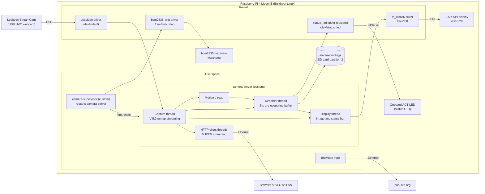

# Project Overview

## Overview

This project builds a network security camera on a Raspberry Pi 4 Model B running a custom
Buildroot Linux image.

**Goals**

* Capture video from a USB webcam with a capture daemon written in C against the V4L2 API.
* Serve a live MJPEG stream over HTTP to several browser clients on the local network at once.
* Detect motion in software by comparing successive camera frames, while keeping
  the most recent 5 seconds of video in a ring buffer in memory.
* When motion is detected, save a timestamped clip to the SD card which starts with the 5
  buffered seconds before the motion and continues until motion has stopped.
* Implement a GPIO character driver which controls a status LED: steady while the
  camera is running, blinking while a clip is being recorded.
* Start everything automatically on boot and rotate old recordings so storage never fills.
* Recover without user action: a supervisor restarts the capture daemon if it crashes, and the
  Pi's hardware watchdog reboots the board if the system hangs.

**Motivation**

Commercial security cameras depend on cloud services and closed firmware. This project is a
self-contained, local-only alternative, and it exercises the full embedded Linux stack covered in
the course: a custom image, a kernel driver, a multi-threaded daemon and network sockets.

**Block diagram**

As built:

At boot the init scripts, in order: load the status LED driver (`S15status-led`), load the
display driver (`S16display`), create (first boot only), check and mount the recordings partition (`S20recordings`), bring up Ethernet by DHCP
(`S40network`), start network time (`S45ntpd`), and start `camera-supervisor`, which runs
`camera-server` (`S90camera-server`). See the [README](../README.md) for using the camera and
getting the recordings off the Pi.

## Target Build System

Buildroot, using `raspberrypi4_64_defconfig` as the base configuration with a
`BR2_EXTERNAL` tree for the project packages.

## Hardware Platform

* **Raspberry Pi 4 Model B**, which is in the course list of
  [Supported Hardware](https://github.com/cu-ecen-aeld/aesd-assignments/wiki/Supported-Hardware-Platforms)
  and supported by Buildroot in
  [board/raspberrypi](https://github.com/buildroot/buildroot/tree/master/board/raspberrypi).
* **[Logitech StreamCam](https://www.logitech.com/en-us/shop/p/streamcam.960-001286)**, a USB
  Video Class webcam handled by the in-kernel `uvcvideo` driver. It has a fixed USB-C cable, so
  it connects to a USB 3.0 port of the Pi through a USB-C to USB-A adapter.
* The Pi's **onboard green activity (ACT) LED**, used as the status LED. A device tree overlay
  releases it from the kernel's default LED driver so the project's GPIO driver can control it.
  No external components are needed.
* Optional: a **3.5" 480x320 SPI touch display** (Hosyond; ILI9486 display controller, XPT2046
  touch controller) plugged onto the GPIO header, which shows the camera image and the recording
  status. The kernel's `fb_ili9486` driver and the Raspberry Pi `piscreen` overlay support it.

All hardware is sourced by me.

## Open Source Projects Used

* [v4l-utils](https://git.linuxtv.org/v4l-utils.git) (`v4l2-ctl`), for camera bring-up and
  debugging.
* [libjpeg-turbo](https://github.com/libjpeg-turbo/libjpeg-turbo), to decode camera JPEG frames
  for software motion detection.
* [BusyBox](https://busybox.net/) `ntpd`, to set the clock from the network, and `fdisk`, with
  util-linux `partx` and e2fsprogs `mkfs.ext4`, to create the recordings partition on first boot.

All are available as Buildroot packages. The capture daemon, HTTP server, motion detector and
GPIO driver are written for this project.

## Previously Discussed Content

* **aesdsocket** (assignments 5, 6 and 9): the threaded socket server, daemon mode, signal
  handling and init script are the basis of the MJPEG HTTP server.
* **aesdchar** (assignments 8 and 9): the character driver structure, file operations, locking
  and `ioctl` handling are the basis of the GPIO driver.
* **Buildroot external tree and packages** (assignments 4, 5 and 7): packaging of the
  application and the kernel module, and module load scripts.
* **POSIX threads and synchronization** (assignment 4 and 6): one capture thread shares frames
  with multiple client threads and the motion detection thread.

## New Content

Discussed in class but not used in previous assignments:

* Kernel timers in a driver, used to blink the status LED while a clip is being recorded.

Not yet discussed in class:

* The [V4L2 capture API](https://www.kernel.org/doc/html/latest/userspace-api/media/v4l/v4l2.html):
  format negotiation with `ioctl`, memory-mapped buffers and streaming I/O.
* The kernel GPIO consumer interface (`gpiod`) and a device tree overlay which
  reassigns the onboard ACT LED pin to the project's driver.
* MJPEG over HTTP (`multipart/x-mixed-replace`) streaming.
* Frame-difference motion detection, a pre-event ring buffer of frames, and clip storage
  management.
* Process supervision and the Linux watchdog interface (`/dev/watchdog`, backed by the Pi's
  `bcm2835_wdt` driver).
* Drawing on a memory-mapped Linux framebuffer (`/dev/fb0`) backed by an SPI display, with
  JPEG frames decoded straight to RGB565.

## Shared Material

None. This project is not used with any other course and does not use components from previous
semesters.

## Source Code Organization

* Buildroot repository (external tree, defconfig and build scripts):
  https://github.com/seto2103/aeld-final-project
* `camera-server`, `camera-supervisor` and the `status_led` driver are in the same repository,
  under `app/` and `driver/`.
* The GitHub Projects board is linked to the same repository and hosted at
  https://github.com/users/seto2103/projects/1

No additional repositories are needed.

## Schedule Page

[Schedule](Schedule.md)
